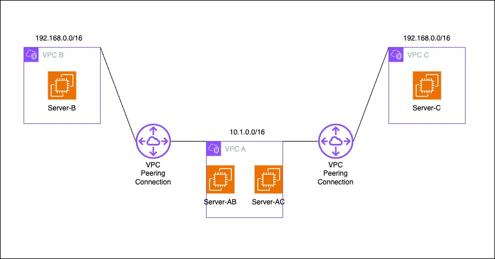

# Exploring AWS VPC Peering with Terraform

This handson demonstrates the setup of VPC peering connections in AWS using Terraform. It includes two test cases with different subnet configurations.

## Test Case 1

In this scenario, Server-AB and Server-AC are placed in the same subnet within VPC-A.

### Setup
1. Navigate to the `testcase1` directory.
2. Run `terraform init` to initialize the Terraform working directory.
3. Run `terraform apply` to create the infrastructure.

### Testing
Follow the instructions provided in the Terraform output after applying the configuration.

## Test Case 2

In this scenario, Server-AB and Server-AC are placed in different subnets within VPC-A.

### Setup
1. Navigate to the `testcase2` directory.
2. Run `terraform init` to initialize the Terraform working directory.
3. Run `terraform apply` to create the infrastructure.

### Testing
Follow the instructions provided in the Terraform output after applying the configuration.

## Notes

- Both test cases require manual intervention to switch the route in VPC-A's route table when testing connectivity with Server-C.
- Remember to run `terraform destroy` in each test case directory when you're done to avoid unnecessary AWS charges.

## Learning Outcomes

Throughout this handson, some learning points emerged:

1. CIDR Block Conflict:
   - VPC-B and VPC-C were initially configured with the same CIDR block (192.168.0.0/16).
   - This caused routing conflicts in VPC-A, as AWS doesn't allow two routes with the same destination CIDR block.
   - Solution: Manual intervention is required to switch the route in VPC-A's route table between VPC-B and VPC-C for testing.

2. SSM Agent Connectivity:
   - Initially, the SSM agent was not connecting in some instances.
   - Root cause: Lack of internet access or proper VPC endpoints for Systems Manager.
   - Solution: Ensured proper IAM roles, security group rules, and either internet access or VPC endpoints were in place.

3. Public IP Assignment:
   - Requirement to assign public IPs only to Server-AB and Server-AC, but not to Server-B and Server-C.
   - Implemented using the `associate_public_ip_address` attribute in the EC2 instance resource.

4. Terraform Resource Management:
   - Encountered issues with resource dependencies and had to adjust the order and structure of resources in the Terraform configuration.
   - Learned the importance of using Terraform's `count` and `for_each` features for creating multiple similar resources efficiently.

5. Manual Steps in Testing:
   - Due to the CIDR block conflict, testing connectivity with Server-C requires manual route table adjustments in the AWS console.
   - This highlighted the limitations of infrastructure-as-code in handling dynamic routing scenarios with conflicting IP ranges.